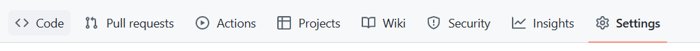
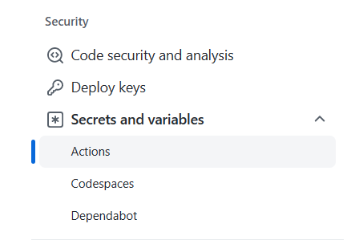
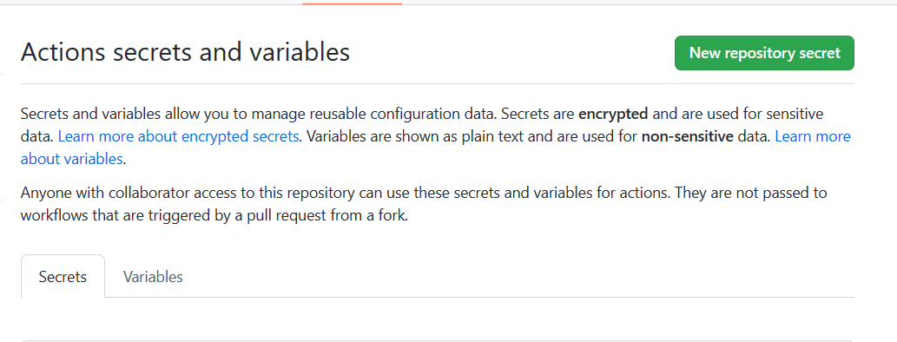
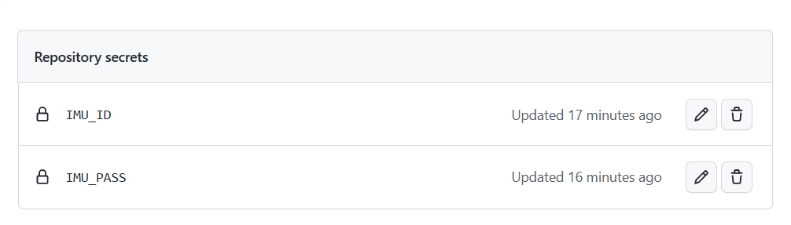
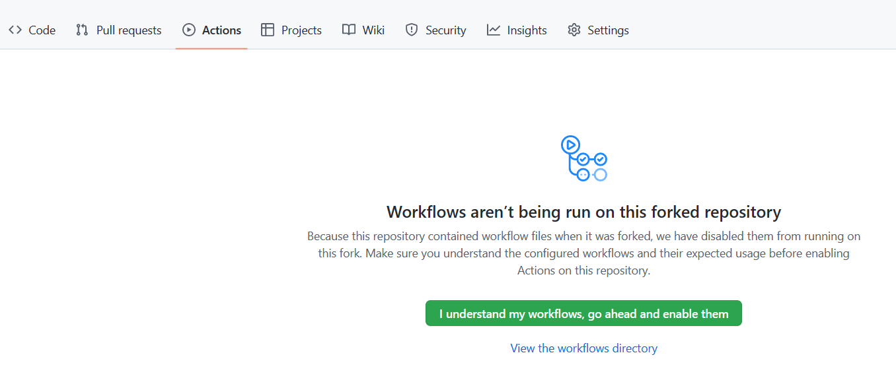
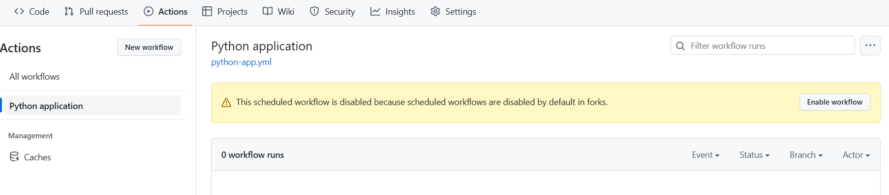
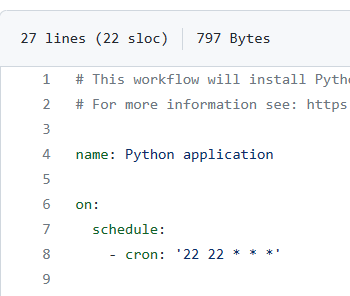
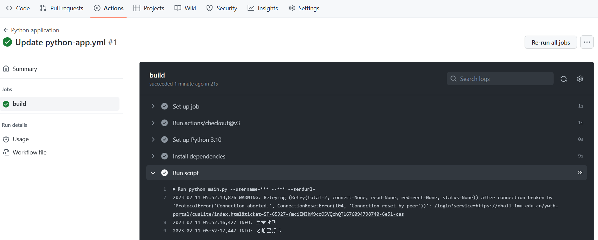

# ImuEhall
内大网上办事服务大厅爬虫

## 使用方法
下载后填写config.ini，运行main.py执行  
必须有打卡记录才能使用打卡功能  
请在本地调试成功后再使用以下方法  

### 拥有自己的服务器
配合定时任务食用更佳
### github Action托管
1.fork该项目，在自己的仓库点击setting标签  
  

2.选择Secrets and variables中的Actions  
  

3.点击绿色按钮添加三项配置  
  
- **IMU_ID**&nbsp;&nbsp;&nbsp;学号  
- **IMU_PASS**&nbsp;&nbsp;&nbsp;密码  
- **IMU_SENDURL**&nbsp;&nbsp;&nbsp;server酱url,可不填
  

4.点击Action标签，点击绿色按钮  
  

5.点击python application，点击右侧黄条 Enable workflow按钮  
  

6.打卡时间通过修改python-app.yml修改  
  

7.enjoy  
